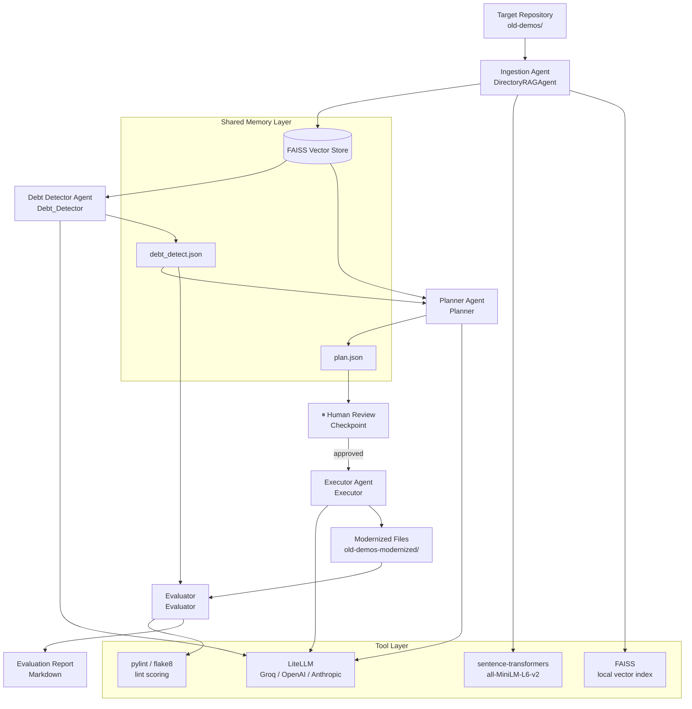

# System Architecture 

> Please note this architecture section draft will be added to our final paper on docx. A draft of this section is included for the sake of easy check-in to milestone 3. 

## Overview

Codapter is a multi-agent system that automatically finds and fixes technical debt in Python codebases. You point it at a repository, it reads through the code, identifies what's outdated or problematic, builds a plan to fix it, and then applies those fixes -- all while keeping a human in the loop before anything actually gets changed. The system is built around four specialized agents -- Ingestion, Debt Detector, Planner, and Executor -- that hand off to each other in a sequential pipeline, with a mandatory human review checkpoint sitting between the planning and execution stages.

Figure 1 shows the full system architecture as of Milestone 3.



---

## Agent Responsibilities

### Ingestion Agent (DirectoryRAGAgent)

The Ingestion Agent is the first step in the pipeline -- it reads through the entire repository and builds a searchable memory from it. It collects all relevant files (.py, .md, .txt, .sh), breaks them into overlapping chunks so context isn't lost at the boundaries, and embeds those chunks using the all-MiniLM-L6-v2 sentence-transformer model. Everything gets stored in a local FAISS index that downstream agents can query as needed. This approach is more efficient than loading entire files into every LLM call -- agents retrieve only the context that's relevant to the task at hand.

### Debt Detector Agent (`Debt_Detector`)

The Debt Detector is where the actual analysis happens. It runs two passes over the codebase -- first a broad repository-level query to catch cross-cutting issues like deprecated import patterns or version compatibility problems, then a file-by-file pass where it asks the LLM to identify specific technical debt across four categories: Compatibility Risk, Maintainability, Lint, and Dependency. Each finding is recorded with the file name, a description of the issue, supporting evidence, and an urgency score from 1 to 5.

Because the underlying LLM (groq/llama-3.1-8b-instant) occasionally produces malformed JSON, the Debt Detector includes a repair loop that attempts to fix bad outputs up to five times before marking a file as failed. This keeps the agent robust without throwing away partial results.


### Planner Agent (`Planner`)

The Planner takes the Debt Detector's findings and turns them into a structured remediation plan for each file. It sorts issues by urgency, combines the file-specific findings with broader repository context, and produces a six-section markdown plan: a Summary, an ordered Recommended Fix Plan, Verification Required Before Fix, a Risk Assessment (Low / Medium / High), Dependencies and Blockers, and Quick Wins. Importantly, the Planner is instructed not to include compatibility findings in the fix plan unless there's concrete evidence of a deprecated or removed construct -- this helps avoid false positives that could introduce regressions.

### Executor Agent (`Executor`)

The Executor applies the approved plan to each source file. For every approved entry, it reads the original file, passes it to the LLM alongside the plan, and gets back a fully modernized version. It's constrained to Low and Medium risk changes only -- High-risk or architectural modifications are explicitly off limits. Modernized files are written to a separate output directory (old-demos-modernized/) that mirrors the original structure, so the source repository is never touched. This makes before-and-after comparison straightforward and gives engineers a chance to review diffs before committing anything.

### Evaluator (`Evaluator`)

The Evaluator wraps everything up with a quantitative summary of how the pipeline performed. It reports on how many files had detected debt, how many were successfully modernized, how urgency was distributed across findings, which debt categories came up most frequently, and what percentage of debt-flagged files made it through execution. When syntax validation data is available, it also reports on that. Everything gets rendered into a structured markdown report at the end.

---

## Agent Coordination

As of Milestone 3, the agents run in a strict sequential pipeline where each stage produces a JSON artifact that becomes the input for the next. This design keeps individual stages independently testable and cacheable -- the expensive RAG initialization and debt detection steps only need to run once, and their outputs can be reused across multiple planning and execution runs.

The pipeline stages and their data handoffs are:

| Stage | Input | Output |
|-------|-------|--------|
| Ingestion | Repository directory | FAISS vector store (in-memory) |
| Debt Detection | FAISS retriever + file contents | `debt_detect.json` |
| Planning | `debt_detect.json` + FAISS retriever | `plan.json` |
| **Human Checkpoint** | `plan.json` | Approved `plan.json` |
| Execution | `plan.json` + original files | Modernized files in output dir |
| Evaluation | `debt_detect.json` + execution results | Markdown report |

The human checkpoint between Planning and Execution is the most important part of the design. Everything before it is read-only -- agents are analyzing and recommending, not touching any files. Once a human reviews the plan and approves it (editing or removing entries as needed), the Executor runs. This is the primary safety gate preventing any automated changes to source code.

---

## Shared State

Two forms of shared state flow through the pipeline.
The FAISS vector store is built once by the Ingestion Agent and passed to any downstream agent that needs retrieval. It's local and ephemeral by default -- rebuilt from scratch each run unless explicitly saved using FAISS.save_local().

The JSON artifacts (debt_detect.json and plan.json) are the more durable piece of shared state. They persist between runs, are human-readable, and allow any downstream stage to be re-run independently without repeating earlier expensive steps. Their schemas are fixed contracts:


```
debt_detect.json  →  { "findings": [{file, category, issue, details, urgency, evidence}], "failures": [...] }
plan.json         →  { "plans": [{file, plan_content}] }
```

---

## Tools and Integrations

| Tool | Role | Integration point |
|------|------|-------------------|
| **LiteLLM** | Provider-agnostic LLM interface (Groq, OpenAI, Anthropic) | All agents via `ChatLiteLLM` |
| **Groq (`llama-3.1-8b-instant`)** | Default LLM backend (low latency, free tier) | `DirectoryRAGAgent._setup_llm()` |
| **sentence-transformers (`all-MiniLM-L6-v2`)** | Local embedding model | `DirectoryRAGAgent.build_vectorstore()` |
| **FAISS** | Local vector similarity index | `DirectoryRAGAgent.build_vectorstore()` / `build_retriever()` |
| **LangChain** | Document loading, chunking, RAG chain assembly | `DirectoryRAGAgent` |
| **pylint / flake8** | Lint scoring for evaluation (before/after error counts) | `Evaluator` (optional subprocess call) |
| **py_compile** | Python syntax validation of executor output | `Evaluator` / optional Verifier |

The LiteLLM abstraction is worth highlighting -- because all agents talk to LLMs through this interface, swapping providers requires only a model identifier change. No agent code needs to be touched. This made it straightforward to benchmark different backends throughout development without any refactoring overhead.

---

## Human-in-the-Loop Checkpoint

The human review checkpoint between Planning and Execution is the most deliberate design decision in Milestone 3. Everything before it is read-only. Everything after it makes real changes. Keeping those two phases clearly separated means the system can never modify source code without explicit human approval.

The plan format is designed to be readable -- it's markdown embedded in JSON, so an engineer can open the file, read through what's being proposed, and edit or remove anything that looks too aggressive before giving the go-ahead. In future milestones, this could be formalized into a UI with per-file approval, inline diffs, and risk ratings all in one place.

---

## Design Principles and Tradeoffs

**Start narrow.** The system targets Python-only repositories and a defined subset of debt categories -- compatibility risks, lint issues, and maintainability patterns. Keeping the scope focused reduces false positives and makes the analysis more tractable than a broader, shallower approach.

**Evidence-driven recommendations.**  Both the Debt Detector and Planner prompts explicitly instruct the LLM to prioritize findings backed by concrete evidence -- like explicit deprecated API calls or removed syntax constructs -- over speculative concerns. Any uncertainty gets surfaced in the "Verification Required" section rather than quietly folded into the fix plan.

**Provider-agnostic LLM layer.** LiteLLM keeps the system from being locked into any one provider. The current default (groq/llama-3.1-8b-instant) is optimized for development-time speed and cost -- switching to a higher-capability model for production is a one-line change.

**Local embeddings.** Using sentence-transformers and FAISS instead of a hosted embedding API keeps the ingestion pipeline offline-capable, reproducible, and free. The tradeoff is slightly lower embedding quality compared to models like text-embedding-3-large, which could reduce retrieval precision on larger or more complex codebases.

**Sequential pipeline over parallel orchestration.** A linear pipeline is easier to debug and reason about than a parallel orchestrator -- every stage's inputs and outputs are fully inspectable, and failures are easy to isolate. The tradeoff is throughput: agents can't run concurrently. A future Orchestrator Agent could parallelize debt detection across files and bring in parallel validation panels, which would significantly improve performance at scale.